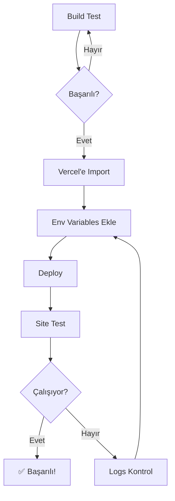

# 🎯 Vercel Deployment Özeti

**Tarih:** 13 Ekim 2025  
**Durum:** ✅ HAZIR  
**Yapılan İşlemler:** Güvenlik önlemleri alındı, deployment rehberleri
oluşturuldu

---

## ✅ TAMAMLANAN İŞLEMLER

### 1. Güvenlik Önlemleri 🔒

#### .gitignore Güncellemesi

```diff
+ .env
+ .env.production
+ .env.development
+ .env.test
+ .gemini/
+ *.key
+ *.pem
+ .secrets/
```

**Sonuç:** API key'ler ve hassas dosyalar artık Git'e commit edilemez.

### 2. Oluşturulan Dökümanlar 📚

| Dosya                        | Açıklama                      | Kullanım                 |
| ---------------------------- | ----------------------------- | ------------------------ |
| `VERCEL-DEPLOYMENT-GUIDE.md` | 20+ sayfa detaylı rehber      | Adım adım deployment     |
| `vercel-deploy-checklist.md` | Basılabilir kontrol listesi   | Her deployment'ta kullan |
| `.env.vercel.template`       | Environment variables şablonu | Vercel'e kopyala         |
| `deploy-ready.md`            | Güncellenmiş hızlı başlangıç  | Hızlı referans           |

---

## 🚀 ŞİMDİ NE YAPMALI?

### Seçenek 1: Hızlı Deployment (30 dk)

```bash
# 1. Build test
cd /Users/tugi/Desktop/busbuskimki
npm run build

# 2. Vercel CLI
npm i -g vercel
vercel login
vercel

# 3. Environment variables ekle (Dashboard'dan)
# 4. Deploy
vercel --prod
```

### Seçenek 2: Dashboard Üzerinden (35 dk)

1. **Vercel'e git:** https://vercel.com/new
2. **Repository import et**
3. **Environment variables ekle** (Settings → Environment Variables)
4. **Deploy butonu**

---

## 📋 MİNİMUM GEREKLİ ENVIRONMENT VARIABLES (14 Adet)

Vercel Dashboard → Settings → Environment Variables:

```bash
# Supabase (4)
NEXT_PUBLIC_SUPABASE_URL=https://xxx.supabase.co
NEXT_PUBLIC_SUPABASE_ANON_KEY=eyJ...
SUPABASE_SERVICE_ROLE_KEY=eyJ...

# App (2)
NODE_ENV=production
NEXT_PUBLIC_SITE_URL=https://your-domain.vercel.app

# AI (1 - en az biri)
GROQ_API_KEY=gsk_xxx
# VEYA
GEMINI_API_KEY=AIza...

# Shopier (4)
SHOPIER_MERCHANT_ID=xxx
SHOPIER_API_KEY=xxx
SHOPIER_API_SECRET=xxx
SHOPIER_TEST_MODE=false  # ⚠️ MUTLAKA false!

# Email (3)
SMTP_HOST=smtp.gmail.com
SMTP_USER=your-email@gmail.com
SMTP_PASS=your-16-digit-app-password

# Security (1)
WEBHOOK_SECRET=your-secure-32-char-secret
```

---

## ⚠️ KRİTİK UYARILAR

### ASLA YAPMAYIN ❌

1. ❌ `.env` dosyasını Git'e commit etmeyin
2. ❌ API key'leri kodda hardcode etmeyin
3. ❌ `SHOPIER_TEST_MODE=true` ile production deploy yapmayın
4. ❌ `SUPABASE_SERVICE_ROLE_KEY`'i client-side'da kullanmayın

### MUTLAKA YAPIN ✅

1. ✅ `npm run build` başarılı olduğunu doğrulayın
2. ✅ Environment variables'ı **Production** environment'ına ekleyin
3. ✅ Deployment sonrası site testlerini yapın
4. ✅ Logs'u ilk 5 dakika izleyin

---

## 🎯 BAŞARI KRİTERLERİ

Deployment başarılı sayılır:

### Build ✅

- [x] `npm run build` hatasız tamamlandı
- [x] Type errors yok (test dosyaları hariç)

### Site ✅

- [ ] HTTPS aktif
- [ ] Ana sayfa açılıyor
- [ ] Auth flow çalışıyor
- [ ] Tarot reading çalışıyor
- [ ] AI yorumları geliyor

### Performance ✅

- [ ] Lighthouse score >85
- [ ] First Paint <2s
- [ ] No console errors

---

## 📊 DEPLOYMENT ADIMLARI



---

## 🆘 SORUN GİDERME

### Build Hatası

```bash
# Çözüm:
cd /Users/tugi/Desktop/busbuskimki
npm install
npm run build
# Hataları düzeltin ve tekrar deneyin
```

### Environment Variable Eksik

```bash
# Çözüm:
# Vercel Dashboard → Settings → Environment Variables
# Eksik değişkeni ekleyin
# Redeploy yapın
```

### 500 Server Error

```bash
# Çözüm:
vercel logs --follow
# Logs'daki hatayı bulun ve düzeltin
```

---

## 📞 DESTEK KAYNAKLARI

### Dökümanlar

- **Ana Rehber:** `VERCEL-DEPLOYMENT-GUIDE.md`
- **Checklist:** `vercel-deploy-checklist.md`
- **Template:** `.env.vercel.template`

### Online Kaynaklar

- **Vercel Docs:** https://vercel.com/docs
- **Next.js Docs:** https://nextjs.org/docs/deployment
- **Supabase Docs:** https://supabase.com/docs

### Vercel Support

- **Dashboard:** https://vercel.com/support
- **Status:** https://www.vercel-status.com

---

## ✅ SONRAKI ADIMLAR

### Hemen Yapılacaklar (Bugün)

1. [ ] **Build test:** `npm run build`
2. [ ] **Vercel hesabı:** Oluştur/Login
3. [ ] **Repository import:** Vercel'e bağla
4. [ ] **Env variables:** 14 kritik değişkeni ekle
5. [ ] **Deploy:** İlk deployment'ı yap
6. [ ] **Test:** Site fonksiyonlarını test et

### Bu Hafta

- [ ] Custom domain bağla (opsiyonel)
- [ ] Monitoring kur (Sentry, Analytics)
- [ ] Performance optimize et
- [ ] SEO check yap

### İleride

- [ ] A/B testing başlat
- [ ] User feedback topla
- [ ] Feature improvements planla

---

## 📈 TAHMİNİ SÜRE

| Adım          | Süre      |
| ------------- | --------- |
| Build test    | 5 dk      |
| Vercel import | 5 dk      |
| Env variables | 15 dk     |
| Deploy        | 5 dk      |
| Test          | 15 dk     |
| **TOPLAM**    | **45 dk** |

---

## ✍️ NOTLAR

### Deployment Bilgileri

```
Deployment Tarihi: ___________
Deployment URL: ___________
Domain: ___________
Deploy Eden: ___________
```

### Karşılaşılan Sorunlar

```
1.
2.
3.
```

### Çözümler

```
1.
2.
3.
```

---

## 🏆 BAŞARI!

Tüm adımları tamamladıysanız:

```
✅ .gitignore güncellendi
✅ Güvenlik önlemleri alındı
✅ Deployment rehberleri hazır
✅ Environment variables template hazır
✅ Checklist oluşturuldu

🚀 DEPLOYMENT'A HAZIRSINIZ!
```

---

**Son Güncelleme:** 13 Ekim 2025  
**Versiyon:** 1.0  
**Durum:** ✅ PRODUCTION READY

**Başarılar! 🎉**
