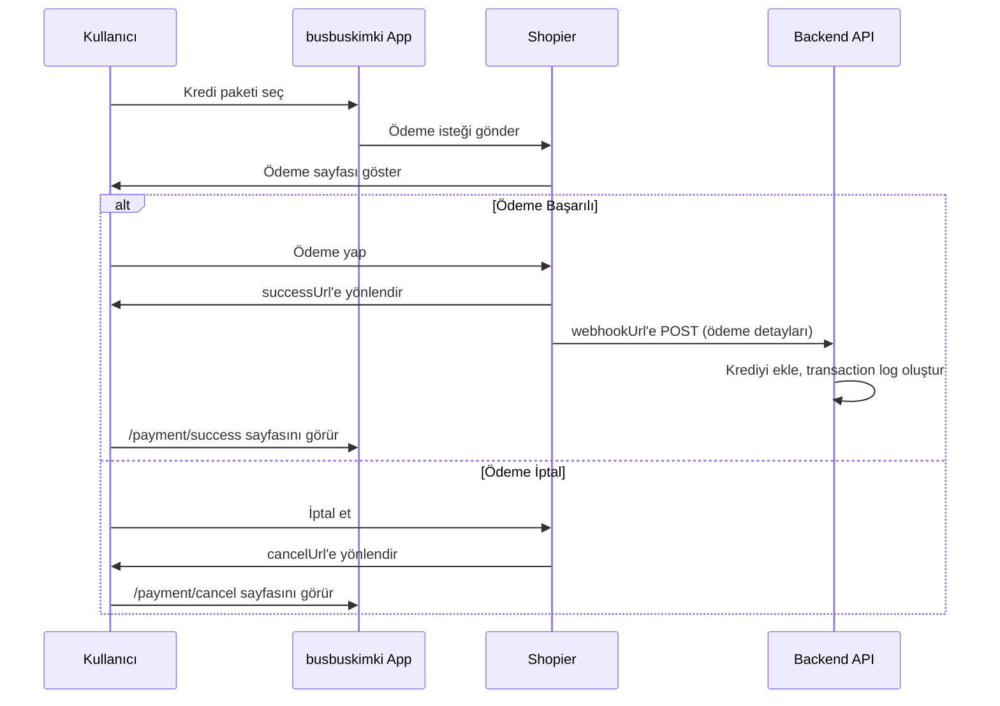

# 🎯 Shopier Terminoloji Güncellemesi

**Tarih:** 14 Ekim 2025 **Durum:** ✅ Tamamlandı

## 📋 Özet

Shopier entegrasyonundaki karışık terminoloji temizlendi ve standardize edildi.
`callbackUrl` terimi kaldırıldı, yerine net ve açık `successUrl` ve `cancelUrl`
kullanımı getirildi.

---

## 🔄 Yapılan Değişiklikler

### 1. **Terminoloji Standardizasyonu**

#### ❌ Eski Terminoloji (Karışık)

```typescript
interface ShopierConfig {
  callbackUrl: string; // ❌ Belirsiz
  webhookUrl: string;
  testMode: boolean;
}
```

#### ✅ Yeni Terminoloji (Net ve Açık)

```typescript
interface ShopierConfig {
  successUrl: string; // ✅ Başarılı ödeme sonrası kullanıcı yönlendirmesi
  cancelUrl: string; // ✅ İptal durumunda kullanıcı yönlendirmesi
  webhookUrl: string; // ✅ Backend webhook endpoint
  testMode: boolean;
}
```

---

### 2. **URL Tanımlamaları**

| URL Tipi       | Amaç                                                      | Örnek                                         | Kullanım                                        |
| -------------- | --------------------------------------------------------- | --------------------------------------------- | ----------------------------------------------- |
| **successUrl** | Başarılı ödeme sonrası kullanıcı yönlendirmesi (Frontend) | `https://busbuskimki.com/payment/success`     | Shopier'dan kullanıcı bu sayfaya yönlendirilir  |
| **cancelUrl**  | İptal durumunda kullanıcı yönlendirmesi (Frontend)        | `https://busbuskimki.com/payment/cancel`      | Kullanıcı ödemeyi iptal ederse bu sayfaya gider |
| **webhookUrl** | Backend webhook endpoint (API)                            | `https://busbuskimki.com/api/webhook/shopier` | Shopier bu endpoint'e POST isteği gönderir      |

---

### 3. **Güncellenen Dosyalar**

#### A. Core Configuration Files ✅

**src/lib/payment/shopier-config.ts**

- ✅ `ShopierConfig` interface güncellendi
- ✅ `callbackUrl` → `successUrl` + `cancelUrl` olarak ayrıldı
- ✅ Fallback URL'ler düzeltildi (`/payment/callback` → `/payment/success`)
- ✅ Environment variable isimleri güncellendi

**src/lib/admin/shopier-system.ts**

- ✅ `ShopierSettings` interface güncellendi
- ✅ `callbackUrl` kaldırıldı
- ✅ Veritabanı kaydetme fonksiyonları güncellendi
- ✅ Validasyon kuralları güncellendi
- ✅ Default ayarlar düzeltildi

**src/lib/config/env-validation.ts**

- ✅ `NEXT_PUBLIC_SHOPIER_CALLBACK_URL` → Kaldırıldı
- ✅ `NEXT_PUBLIC_SHOPIER_SUCCESS_URL` → Eklendi
- ✅ `NEXT_PUBLIC_SHOPIER_CANCEL_URL` → Eklendi
- ✅ `SHOPIER_TEST_MODE` → Eklendi

#### B. Frontend Files ✅

**src/app/[locale]/admin/settings/page.tsx**

- ✅ Callback URL input alanı kaldırıldı
- ✅ Success URL, Cancel URL ve Webhook URL sıralaması düzenlendi
- ✅ Her URL alanına açıklayıcı tooltip eklendi
- ✅ Placeholder URL'ler production domain'leri ile güncellendi

#### C. Environment Files ✅

**env.example**

```bash
# ❌ Eski
NEXT_PUBLIC_SHOPIER_CALLBACK_URL=busbuskimki.com/draft1/wc-api/WC_Shopier
NEXT_PUBLIC_SHOPIER_WEBHOOK_URL=http://localhost:54321/functions/v1/payment-webhook

# ✅ Yeni
SHOPIER_TEST_MODE=false
NEXT_PUBLIC_SHOPIER_SUCCESS_URL=https://busbuskimki.com/payment/success
NEXT_PUBLIC_SHOPIER_CANCEL_URL=https://busbuskimki.com/payment/cancel
NEXT_PUBLIC_SHOPIER_WEBHOOK_URL=https://busbuskimki.com/api/webhook/shopier
```

**vercel-env-template.txt**

- ✅ Tüm Shopier URL'leri güncellendi
- ✅ Açıklayıcı yorumlar eklendi

#### D. Deployment Documentation ✅

**VERCEL-DEPLOYMENT-GUIDE.md**

- ✅ Environment variables bölümü güncellendi
- ✅ Shopier konfigürasyon örnekleri düzeltildi

**vercel-deploy-checklist.md**

- ✅ Checklist itemları güncellendi
- ✅ CALLBACK_URL → SUCCESS_URL + CANCEL_URL

**deploy-ready.md**

- ✅ URL örnekleri güncellendi
- ✅ Açıklamalar netleştirildi

---

## 🎯 Environment Variables Değişiklikleri

### Production (.env veya Vercel Environment Variables)

```bash
# Shopier Payment Configuration
SHOPIER_MERCHANT_ID=https://www.shopier.com/busbuskimki
SHOPIER_API_KEY=your-api-key-here
SHOPIER_API_SECRET=your-api-secret-here
SHOPIER_TEST_MODE=false  # ⚠️ Production'da MUTLAKA false!

# Shopier URLs (Production)
NEXT_PUBLIC_SHOPIER_API_URL=https://www.shopier.com/ShowProduct/api_pay4.php
NEXT_PUBLIC_SHOPIER_SUCCESS_URL=https://busbuskimki.com/payment/success
NEXT_PUBLIC_SHOPIER_CANCEL_URL=https://busbuskimki.com/payment/cancel
NEXT_PUBLIC_SHOPIER_WEBHOOK_URL=https://busbuskimki.com/api/webhook/shopier
```

### Development (.env.local)

```bash
# Shopier Payment Configuration
SHOPIER_MERCHANT_ID=https://www.shopier.com/busbuskimki
SHOPIER_API_KEY=your-test-api-key
SHOPIER_API_SECRET=your-test-api-secret
SHOPIER_TEST_MODE=true  # ✅ Development'da true

# Shopier URLs (Development)
NEXT_PUBLIC_SHOPIER_API_URL=https://www.shopier.com/ShowProduct/api_pay4.php
NEXT_PUBLIC_SHOPIER_SUCCESS_URL=http://localhost:3111/payment/success
NEXT_PUBLIC_SHOPIER_CANCEL_URL=http://localhost:3111/payment/cancel
NEXT_PUBLIC_SHOPIER_WEBHOOK_URL=http://localhost:3111/api/webhook/shopier
```

---

## 🔧 Shopier Merchant Panel Ayarları

Shopier Merchant Panel'de şu ayarları yapmanız gerekiyor:

### 1. **Webhook URL (Backend - Zorunlu)**

```
https://busbuskimki.com/api/webhook/shopier
```

**Amaç:** Ödeme sonuçlarını backend'e bildirir (kredi ekleme, transaction log)

### 2. **Return URL (Success - Frontend)**

```
https://busbuskimki.com/payment/success
```

**Amaç:** Başarılı ödeme sonrası kullanıcıyı yönlendirir

### 3. **Cancel URL (Frontend)**

```
https://busbuskimki.com/payment/cancel
```

**Amaç:** İptal edilen ödeme sonrası kullanıcıyı yönlendirir

---

## 📊 Ödeme Akışı



---

## ✅ Test Checklist

- [x] Terminoloji standardize edildi
- [x] `callbackUrl` tüm dosyalardan kaldırıldı
- [x] Environment variables güncellendi
- [x] Deployment dosyaları güncellendi
- [x] Admin settings sayfası güncellendi
- [x] Linter hataları kontrol edildi (Hata yok ✅)
- [ ] Shopier Merchant Panel'de URL'ler güncellendi
- [ ] Production environment variables güncellendi
- [ ] Test ödemesi yapıldı
- [ ] Gerçek ödeme testi yapıldı

---

## 🚨 Önemli Notlar

1. **Eski environment variables** (NEXT_PUBLIC_SHOPIER_CALLBACK_URL) artık
   kullanılmıyor
2. **Yeni variables** (SUCCESS_URL ve CANCEL_URL) mutlaka tanımlanmalı
3. **Shopier Merchant Panel'deki URL'ler** mutlaka güncellenmeli
4. **Production deployment** sonrası environment variables kontrol edilmeli
5. **Test modunu kapatmayı unutmayın** (SHOPIER_TEST_MODE=false)

---

## 📝 Migration Guide (Mevcut Deployment İçin)

### Adım 1: Environment Variables Ekle

Vercel Dashboard → Settings → Environment Variables

```bash
# Ekle:
NEXT_PUBLIC_SHOPIER_SUCCESS_URL=https://busbuskimki.com/payment/success
NEXT_PUBLIC_SHOPIER_CANCEL_URL=https://busbuskimki.com/payment/cancel

# Eski olanı sil (artık kullanılmıyor):
NEXT_PUBLIC_SHOPIER_CALLBACK_URL
```

### Adım 2: Shopier Panel Güncelle

1. https://www.shopier.com/merchant → Ayarlar
2. Webhook URL: `https://busbuskimki.com/api/webhook/shopier`
3. Return URL: `https://busbuskimki.com/payment/success`
4. Cancel URL: `https://busbuskimki.com/payment/cancel`

### Adım 3: Redeploy

```bash
git pull origin buildok2
vercel --prod
```

---

## 🎉 Sonuç

✅ **Tamamlandı:** Shopier terminolojisi tamamen netleştirildi ve standardize
edildi. Artık her URL'nin amacı ve kullanımı çok açık!

**Next Steps:**

1. Shopier Merchant Panel'i güncelle
2. Production environment variables'ı güncelle
3. Test ödemesi yap
4. Production'da gerçek ödeme testi yap

---

**Hazırlayan:** AI Assistant  
**İnceleme Tarihi:** 14 Ekim 2025  
**Versiyon:** 1.0
